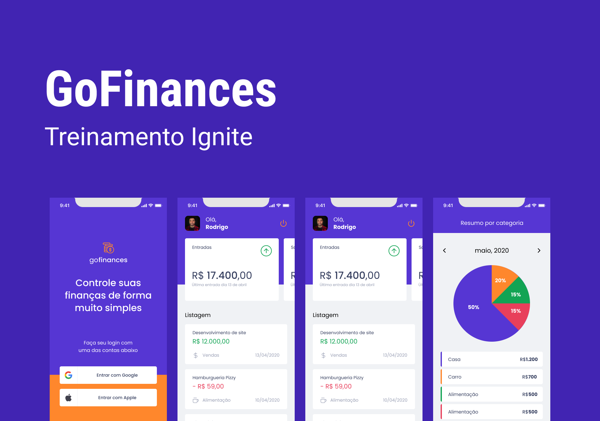

<h1 align="center">
    
</h1>

## 💻 Sobre o projeto

Aplicação desenvolvida durante a trilha react native do Ignite da Rocketseat para fazer o controle de finanças.

Essa aplicação conta com a possibilidade de controlar entradas e saídas, ou seja, gastos e ganhos financeiros. Assim como possui login social e gráfico de cada mês com o balanço de gastos e ganhos refentes as categorias.

---

## ⚙️ Funcionalidades

- Login social.
- Adicionar uma entrada.
- Adicionar uma saída.
- Visualizar histórico.
- Visualizar gráfico mensal.

Para o desenvolvimento foram aplicados conceitos como:
- ContextAPI
- LocalStorage
- Hooks
- Routes
- Typescript

---

## 🛠 Tecnologias
As seguintes ferramentas foram usadas na construção do projeto:

#### **Mobile**  [Expo](https://nextjs.org/docs/getting-started)

-   **[Yup](https://www.npmjs.com/package/yup)**
-   **[Victory Native](https://www.npmjs.com/package/victory-native)**
-   **[Styled Components](https://docs.expo.dev/guides/using-styled-components/)**
-   **[Date fns](https://date-fns.org/)**
-   **[React Hook Form](https://www.npmjs.com/package/react-hook-form)**

---

## 🦸 Autor

  
 <b>Everton Schultz</b></a>
  

